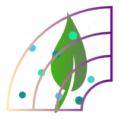

<!-- README.md is generated from README.Rmd. Please edit that file -->

# collmaps



The goal of collmaps is to provide simple tools to check plant
collection records. It provides a user interface to upload an excel
table that must have at least three columns with these names: ID, lat,
and lon.

## Installation

You can install the released version of collmaps from github with:

``` r
install.packages("devtools")
devtools::install_github("rsimon64/collmaps")
```

## Example

The interface can be started from the addin menu in RStudio or from the
terminal:

``` r

collmaps::cm_map()
```
